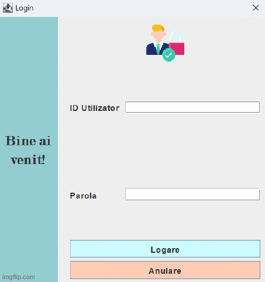

## 🎓 Study Platform

University project written in Java with Swing GUI and MySQL backend.
Developed by Bartus Bíborka and Ciotea Alessia for the Databases course at the Technical University of Cluj-Napoca, Faculty of Automation and Computer Science.

## 📽️ Overview 

## 🚀 Key Features

### **Multi-Role Authentication & Authorization**
* **Four User Levels**: Supports Students, Professors, Administrators, and Super-Administrators.
* **Secure Access**: Entry is restricted via unique IDs and passwords.
* **Permission Management**: Administrators manage user data (students and professors), while Super-Administrators hold exclusive rights to manage other administrator accounts.

### **Academic Management**
* **Smart Enrollment**: Students are automatically assigned to the professor with the lightest current workload at the time of registration to ensure balanced teaching.
* **Automated Grading**: Uses stored procedures to calculate final grades based on custom-weighted percentages (0-100) for courses, seminars, and labs.
* **Dynamic Calendar**: A scheduling system for courses, seminars, and exams that prevents scheduling conflicts.
* **Data Portability**: Users can export catalogs and schedules into **CSV format** for external use.

### **Social & Collaborative Learning**
* **Study Groups**: Students can create and join subject-specific groups for collaborative learning.
* **Messaging System**: Features an integrated chat platform for communication within study groups, including timestamps and sender identification.
* **Group Activities**: Students can organize extra-curricular deep-dive sessions with minimum participant thresholds and automated cancellation logic if requirements aren't met.

## 🛠️ Technologies used

* **Language**: Java.
* **Database**: MySQL.
* **GUI Framework**: Java Swing.
* **Connectivity**: JDBC (Java DataBase Connectivity) with parameterized SQL queries for security.

## 📊 Database Architecture

The system relies on a relational model consisting of **16 interconnected tables**.

## ⚙️ Setup

This project uses a local MySQL database.
Database credentials are not included and must be configured locally.
To run the application:
1. Install Java 23 or newer
2. Install MySQL and create the database `platforma_de_studiu`
3. Configure your database credentials in `DatabaseConnection.java`
4. Run `Main.java`
### Database Setup
The database for this project can be created using the SQL scripts in the `sql_scripts/` folder.

## 📖 Documentation

Detailed project documentation addressing design, architecture, user manual (in Romanian) is available in the `docs/` folder.

## 🧠 Lessons Learned

* **Task Delegation**: We divided the system into modules.
* **Effective Communication**: We maintained a clear development roadmap to ensure the JDBC connectivity seamlessly integrated with the Stored Procedures and Triggers being written in MySQL.
* **Database Normalization**: Learned the importance of 3NF in preventing update anomalies and maintaining data consistency across 16 tables.
* **Backend Security**: Gained experience in preventing SQL injection by using parameterized queries through JDBC.
* **UI State Management**: Implemented `CardLayout` to handle complex navigation flows between different user roles within a single-window application.
* **Atomic Operations**: Used Stored Procedures to ensure that creating a calendar event and its associated activity happened as a single, successful unit.
* **Documentation Standards**: Created comprehensive documentation to ensure the project meets academic and professional standards.